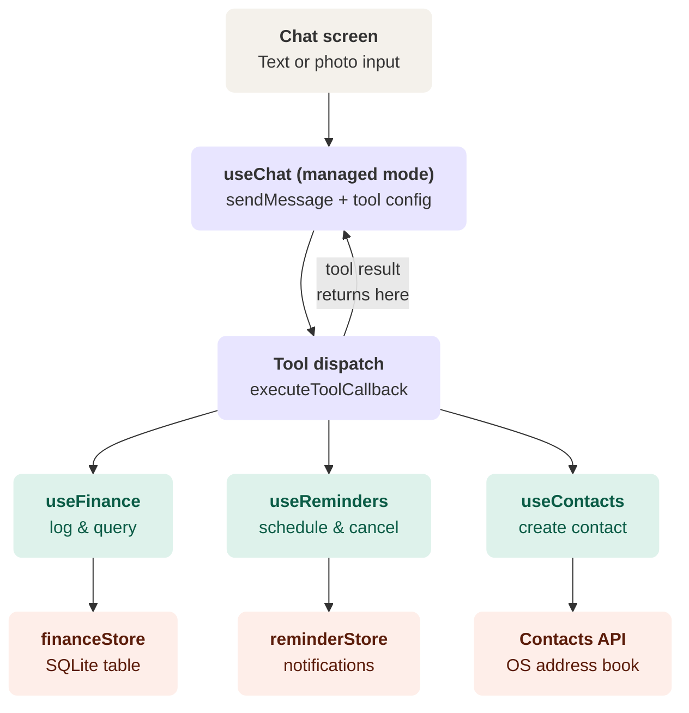

`react-native-executorch`'s `useLLM` already ships native tool/function calling for managed chats — tool calling lets the model use external functions to perform tasks, and in managed mode tool calls are parsed and executed automatically once you pass the right callbacks, and it's explicitly designed for things like checking calendars, scheduling, or any native action you wire up. So you don't need to write a classifier prompt or sniff the token stream yourself — the "router" you described is a configuration object (`toolsConfig`) you already have a slot for in `useChat.ts`, sitting right next to the `configure()` call you're calling for `systemPrompt`/`temperature`.

Here's the layered picture, store through UI:That diagram is the core insight: everything below `useChat` is just the same store → context → hook pattern you've already built for models, repeated three more times. There's no separate "router" module to invent — `useChat` itself becomes the router once you give it a `toolsConfig`.

**Why the single-pass loop matters.** In the previous plan, the worry was running the model twice (classify, then fetch-and-speak) and eating latency. With native tool calling, it's one `sendMessage` call: the model decides mid-generation whether to emit plain text or a tool call. If it emits a tool call, `executeToolCallback` runs your function, the result string gets fed back into the same generation, and the model continues into natural language — all inside one `sendMessage` invocation, which is what the dashed arrow back into `useChat` on the diagram represents. You don't manage that hand-off; the library does.

**Where each existing file's job changes.**

`modelStore.ts` stays exactly as it is — it's the pattern to clone, not touch. You'll write `financeStore.ts` (expo-sqlite CRUD), `reminderStore.ts` (expo-notifications scheduling plus a small persisted index so you can cancel by ID later), and for contacts you likely don't need a store at all — `expo-contacts` writing to the OS address book _is_ the source of truth, the way `ResourceFetcher` writing to disk is the source of truth for models.

`ModelContext.tsx` stays as-is too. You'll add sibling contexts — `FinanceContext`, `RemindersContext` — for the same reason `ModelContext` exists: state that's read from more than one screen (a finance dashboard screen and the chat screen both need the expense list) and needs a persisted source of truth behind it. If a domain is only ever touched from chat and never has its own screen, skip the context and just call the store from the hook directly.

`useChat.ts` gets the new responsibility. It already composes `useModel()` and calls `configure()` — you extend that same `useEffect` to also pass `toolsConfig: { tools, executeToolCallback, displayToolCalls: false }`. `executeToolCallback` is a `switch` on `call.toolName` that calls into `useFinance()`, `useReminders()`, `useContacts()` — which `useChat` now also composes, the same way it currently composes `useModel`. Hooks calling hooks is fine; this is just one more layer of the pattern you already have.

`useAttachment.ts` mostly stays put, but its output needs a fork before it reaches `useChat`. Your active model's `capabilities` array (hardcoded to `["vision"]` in the current `useChat` regardless of which model is loaded, worth fixing) determines the path: a vision-capable model can take the image straight into `sendMessage(text, { imagePath })`; a text-only model needs the extracted-text path instead. ExecuTorch ships a `useOCR` hook for exactly this, which is worth trying before reaching for Google ML Kit as the previous plan suggested — it keeps you on one native dependency instead of two.

`modelStore`\-style persistence aside, `index.tsx` and `MessageList` need one structural change: today a message is just role/content/mediaPath. Once tools exist, you need a message variant that can render a confirmation card with editable fields, not just text. That typing change ripples into whatever component renders the message list, so it's worth doing before the first real domain tool, not retrofitted after three domains are wired up.

**Build order, smallest reliable slice first:**

1. Build `financeStore.ts` \+ `useFinance` \+ a bare debug screen (manual add/list buttons, no chat involved). Get the SQLite layer solid in isolation.
2. Wire `log_expense` and `query_expenses` as tool definitions, extend `useChat`'s `executeToolCallback` to dispatch into `useFinance`.
3. Repeat the same step shape for reminders, then contacts — by now the scaffolding (tool registry, dispatch switch) is already generic, so each new domain is mostly just its own store and hook.
4. Add the image/receipt path on top of the already-working text+tools pipeline: branch on model vision capability, run `useOCR` for non-vision models, and feed the resulting text into the exact same `sendMessage` call — no new dispatch logic needed.
5. Pull the tool list into the `constants/tools.ts` registry once you have two or three domains, so the next one is additive rather than a rewrite.
